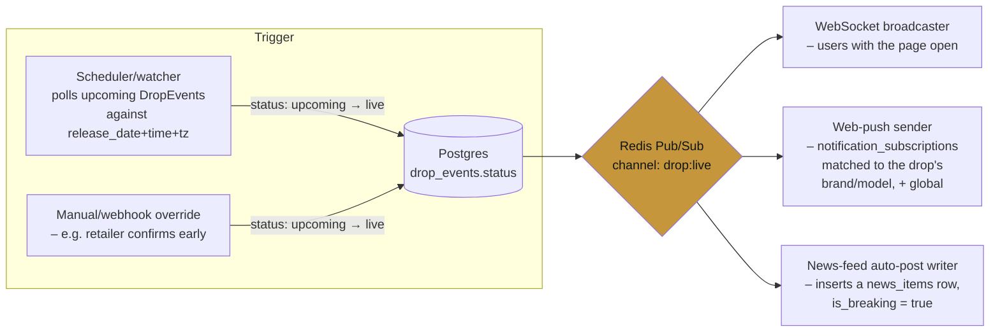

# Drops & news (Day 12 — schema + architecture, no code yet)

Phase 3, Feature 3: instant launch news/drops. This is a Day 1-style
day — the goal was to lock the data model and content strategy before
writing a scheduler, a consumer, or a UI component, so Day 13 (the
watcher + pub/sub pipeline) and Day 14+ (the magazine UI) build against
something settled instead of discovering a schema gap mid-build. No
runtime code changes today; the deliverable is
`apps/api/drizzle/0006_drops_and_news.sql` (applied and hand-verified
against local Postgres — inserts, the scope check constraint, and both
unique constraints all confirmed to behave as designed) plus this
document.

## Schema

### `drop_events`

| Column | Notes |
|---|---|
| `sneaker_id` | FK → `sneakers`, `CASCADE` — a drop only exists for a catalogued sneaker. |
| `release_date` | `DATE NOT NULL` — always known before the exact hour is. |
| `release_time` | `TIME`, nullable. `NULL` means "date confirmed, hour TBA" — a real, displayable state (Day 14 renders this as "Oct 1 · time TBA"), not missing data. |
| `release_timezone` | IANA zone name (`Asia/Kolkata` default), not a stored offset — an offset silently goes wrong across a DST boundary, a zone name never does. |
| `regions` | `region[]` — reuses Day 1's existing enum (`india`/`us`/`global`) rather than inventing a new one. |
| `retail_price`, `currency` | Same shape as `sneakers.retail_price` / `currency`. |
| `status` | `upcoming` / `live` / `sold_out` — see the pub/sub section for what flips it. |
| `purchase_links` | `JSONB`, official retailer links only — **never** the resale price-comparison offers `price_snapshots` already tracks. See the legal note below on why these two link types must never render without a visible distinction. |
| `raffle_info` | `JSONB`, nullable — see the decision below. |

**v1 covers raffles, minimally.** Many hyped Indian/global drops (Nike
SNKRS Draw, adidas Confirmed) are raffle-based, not first-come-first-
served, and that changes Day 14's primary CTA from "Buy now" to "Enter
raffle" — deferring this to v2 would mean redesigning the drop detail
page's most important button shortly after shipping it. So `raffle_info`
exists now as a nullable JSONB blob: `registration_url`,
`registration_closes_at`, `method`. CHOSN never runs the raffle itself —
this is metadata for a link-out, identical in spirit to how `retailers`
already stores affiliate templates rather than payment logic. No new
table, no entry-tracking, no "did I win" state — that would mean CHOSN
holding user PII tied to a giveaway it doesn't run, which is scope and
liability this feature doesn't need.

**One deliberate v1 simplification:** one `release_date` /
`release_time` pair per `DropEvent`, not one per region. A drop that
genuinely goes live at different local times in India vs. globally needs
either two `DropEvent` rows or a future per-region timing column — out
of scope today because the launch catalog's drops are India-first single
events; revisit if/when a multi-region simultaneous drop with staggered
local times actually needs modeling.

### `news_items`

| Column | Notes |
|---|---|
| `drop_event_id` | FK → `drop_events`, nullable, `SET NULL` on delete — not all news is drop-specific (a policy change, a general sale event). |
| `source` | Attribution string — `"CHOSN editorial"` for originals, the feed's own name otherwise. Always shown, never blended. |
| `source_url` | Set only when `body` is sourced from a licensed/aggregated feed — the "link to the original" a licensing deal typically requires, and the audit trail for the copyright check below. |
| `is_breaking` | The **only** signal that triggers an instant push — see §5 of the brief and the pub/sub section. Ambient news (a routine restock note, a minor price-history blurb) publishes to the feed quietly; it does not fan out to push/WebSocket/email. This is what keeps subscribers from unsubscribing after the first week. |

### `subscribers`, `web_push_subscriptions`, `notification_subscriptions`

**Flagged assumption — sign-off needed.** CHOSN has no accounts or auth
system at all today. The only existing "person" record is
`waitlist_entries` (Day 5), a one-way capture form, not a login. This
feature is the first one that needs to notify someone, which needs *some*
identity to notify.

Building full authentication (passwords, sessions, login/logout UI) to
unblock a notifications feature is real scope creep for Phase 3, and
most sites don't gate "notify me about drops" behind an account anyway —
a browser-level push permission or a bare email is the normal, lower-
friction pattern (the same one the waitlist form already uses). So:

- **`subscribers`** — `id` + optional `email`. Not an account: no
  password, no session, no login. A row is created the instant a visitor
  enables push or types an email into a "notify me" control.
- **`web_push_subscriptions`** — the standard Web Push API shape
  (`endpoint`, `p256dh`, `auth`), one subscriber can hold several (one
  per browser/device).
- **`notification_subscriptions`** — `(subscriber_id, scope_type,
  scope_value)`, `scope_type ∈ {brand, model, global}`. A `CHECK`
  constraint enforces `scope_value IS NULL` iff `scope_type = 'global'`
  (verified: a `global` row with a non-null `scope_value` is rejected at
  the database, not just in application code), and a `COALESCE`-based
  unique index stops the same subscriber double-subscribing to the same
  thing, including duplicate `global` rows (verified — plain
  `UNIQUE(subscriber_id, scope_type, scope_value)` would not have caught
  that case, since `NULL <> NULL`).

If/when CHOSN builds real accounts, `subscriber_id` is a straightforward
migration target for `user_id` — a `subscribers` row becomes a `users`
row's notification preferences, not a redesign. **Please confirm this
lightweight-identity approach is acceptable for now**, versus building
real accounts first — that's a real product-scope call, not just a
technical one.

**Subscription granularity:** per-brand or per-model, matching the
brief's recommendation — `global` exists in the enum and is fully
functional, but Day 14's UI should present brand/model as the default
choice, with global available for someone who explicitly wants
everything. Global-only notification programs tend to become noise and
drive unsubscribes; the schema doesn't block it, but the product should
nudge away from it.

## Content sourcing strategy — **hybrid (recommended, needs sign-off)**

**Decision:** structured drop-calendar data (release date/time, price,
regions, official purchase links) sourced broadly — scraped or
aggregated from public retailer/brand pages and existing drop-calendar
sites — paired with a short original write-up authored for each drop
involving one of the ~20-30 launch-catalog models (today, actually 5
catalogued models / 10 variants — see the note below). Everything else
in the feed (wider sneaker-world news) either stays uncovered at launch
or is added editorially as capacity allows, never republished from
another outlet's article text.

**Why not editorial-only:** highest quality and cleanest IP position,
but doesn't scale past a handful of drops a week without dedicated
headcount CHOSN doesn't have yet — the same "doesn't scale without
headcount" tradeoff the brief names.

**Why not licensed-feed-only:** fastest coverage, but original-content
SEO value is low (nothing on the page a search engine hasn't indexed
from the licensor already) and it adds an ongoing licensing cost/
negotiation before the feature has proven it drives engagement.

**Why the hybrid split holds up legally:** the load-bearing distinction
is *facts vs. expression*. A release date, a price, a region, a raffle
registration link — these are facts, not copyrightable, and sourcing
them broadly (scraping a retailer's own drop page, aggregating a public
drop calendar) carries the same ToS diligence Day 1 already applied to
retailer price data: check each source's ToS for an explicit
anti-scraping clause before pulling from it, same as Day 1 §01's
retailer-tier review, and prefer an API/feed over scraping wherever one
exists (mirrors Day 1's decision to drop `scrape` as an integration type
entirely for pricing — the same standard should apply here). What is
never acceptable, regardless of ToS, is reproducing another outlet's
article text — the write-up per drop is original, factual data feeds it.

**Ongoing cost this creates, flagged explicitly per the brief's ask:**
either a licensing fee (if a specific structured-feed provider is
chosen — none is contracted yet, this is a strategy decision, not a
vendor decision) or editorial time to write ~20-30 short drop write-ups
plus keep pace with new ones — not zero, and it recurs. **Please sign
off on the hybrid approach itself before Day 13 build starts**; picking
a specific licensed-feed vendor (if any) is a separate decision this
doesn't lock in.

**Correction to the brief's stated catalog size:** the brief's context
references a 20-30 model launch catalog; the actual seeded catalog today
(`apps/api/drizzle/0002_seed_flipkart_and_test_set.sql`) is 5 sneakers /
10 variants (Nike Dunk Low Panda, Air Force 1 '07 Triple White, adidas
Samba OG, adidas Campus 00s, New Balance 550). The schema and sourcing
decision here don't depend on the exact count — they hold at 5 or 30 —
but editorial write-up effort scales with whichever number is real, so
flagging the gap rather than quietly writing "30" into a cost estimate.

## "Instant" mechanism — architecture (design only when written, built Day 13 — see the implementation section below)



**Trigger side.** A scheduler/watcher process (Day 13) polls
`drop_events` for rows where `status = 'upcoming'` and
`release_date`/`release_time`/`release_timezone` have passed —
`drop_events_upcoming_idx` (a partial index, `WHERE status =
'upcoming'`) is built for exactly this query, so the poll never scans
live/sold-out rows as the table grows. A manual/webhook path also exists
for the case a retailer confirms a drop went live early or late —
either path ends the same way: one `UPDATE drop_events SET status =
'live'`. (The manual/webhook trigger path itself is not built — Day 13
built the automatic poll only; see "What Day 13 actually built" below.)

**One publish, many consumers.** That single status change publishes
one event to a Redis Pub/Sub channel — named `drop:live` in the actual
build, not the `drop-events` label this diagram used before Day 13
picked the Day 13 brief's own example name — using the Redis already
provisioned for Market Intelligence's cache, no new infrastructure. The
payload is small and self-contained (`dropEventId`, `sneakerId`,
`timestamp`) — consumers re-read whatever they need from Postgres
rather than the event carrying a denormalized copy that can go stale.

Three independent consumers subscribe to that one channel:

1. **WebSocket broadcaster** — pushes to any client with the relevant
   page open (a drop's detail page, or the news feed).
2. **Web-push sender** — queries `notification_subscriptions` for rows
   matching the drop's brand or model, plus every `global` row, and
   sends via the Web Push protocol using each matched subscriber's
   `web_push_subscriptions` rows.
3. **News-feed auto-post writer** — inserts a `news_items` row
   (`is_breaking = true`, `source = 'CHOSN'`, `drop_event_id` set) so the
   "drop just went live" announcement is itself a feed item, not a
   separate notification-only artifact.

**Why pub/sub instead of each consumer polling `drop_events` itself:**
the trigger logic (the scheduler) never needs to know how many consumers
exist or what they do — Day 15+ adding a fourth consumer (e.g.
auto-creating a community chat room for the drop, mentioned in the
brief) is a new subscriber to the same channel, zero changes to the
watcher. This is the actual point of today's design pass: decouple
"detecting a drop went live" from "everything that should happen when it
does."

**`is_breaking` is what gates the push/WebSocket fan-out for *news*
specifically** — a drop going `live` always fans out (that's the
feature), but an editorial `news_items` row only fans out through the
same channel if `is_breaking = true`. A routine "restock expected next
week" post publishes to the feed without waking anyone's phone.

## Legal/compliance check

- **Structured drop-calendar facts** (date, price, region, raffle
  link) — not copyrightable, broad sourcing is fine subject to the same
  per-source ToS check Day 1 already applies to retailer pricing (no
  blanket scraping where a source's ToS explicitly forbids it; prefer an
  API/feed over scraping wherever one exists).
- **Article text from a licensed/aggregated source** — never
  reproduced. `source` + `source_url` exist specifically so a licensed
  fact is always attributed and linked, never presented as CHOSN's own
  writing.
- **`purchase_links` vs. resale offers — the clarity issue the brief
  calls out by name.** `purchase_links` are official retailer links:
  CHOSN earns nothing on them, they are "where to try to buy at retail."
  The existing price-comparison "View Deal" buttons are affiliate links:
  CHOSN earns a commission. These must never render on the same page
  without a visible, textual distinction (not just color) — this is a
  UI requirement for Day 14, flagged here so it isn't discovered as an
  afterthought once the drop detail page is being built. The existing
  `AffiliateDisclosure` component (Day 10) is the right pattern to
  extend, not a new mechanism to invent.

## What's still open (not blocking Day 14)

- Sign-off on the lightweight-identity (`subscribers`) approach vs.
  building real accounts first.
- Sign-off on the hybrid content-sourcing strategy and its ongoing cost
  (licensing fee or editorial time — not yet quantified against a
  specific vendor).
- No specific licensed-feed vendor is chosen — a separate decision once
  the hybrid strategy itself is signed off.

---

# Day 13 — scheduler + pub/sub, built and verified

Turned the design above into running code: the BullMQ scheduler that
flips `drop_events.status`, the `drop:live` Redis Pub/Sub publisher, and
the first consumer (news-feed auto-post). Day 14 adds the WebSocket and
web-push consumers as more subscribers to the same channel — nothing
here changes when that happens, which was the actual point of yesterday's
design pass.

## What was built

| File | What |
|---|---|
| `apps/api/drizzle/0007_drop_scheduler_monitoring.sql` | `drop_scheduler_runs`, `drop_consumer_failures`, and a partial unique index (`news_items_auto_post_unique`) making the auto-post idempotent per drop. |
| `drop-events.pubsub.ts` | The channel name (`drop:live`) and payload shape (`dropEventId`, `sneakerId`, `timestamp`) — the one contract every publisher/consumer agrees on. |
| `drop-scheduler.service.ts` | BullMQ recurring job (default every 1 minute, `DROP_SCHEDULER_INTERVAL_MINUTES`). One atomic `UPDATE ... WHERE status = 'upcoming' ... RETURNING` per tick (the idempotency guard task 2 asked for), then one Pub/Sub publish per flipped row, then one durable run record. |
| `drop-news-auto-post.service.ts` | Subscribes to `drop:live` on its own dedicated Redis connection, re-reads the drop from Postgres, and inserts a `news_items` row via `auto-post-template.ts`. |
| `auto-post-template.ts` | The factual, auto-generated announcement copy — see its own header comment for how this fits the hybrid content strategy (facts, not the human write-up). |
| `drop-health.service.ts` / `drop-health.controller.ts` | `GET /health/drops` — scheduler run history + per-consumer failure counts, same shape as `GET /health/fetch`. |
| `drops.module.ts` | Imports `PricingModule` for the shared pg pool/Drizzle instance rather than opening a third connection pool (WaitlistModule and PricingModule each already open their own — see the module's own comment). |
| `scripts/seed-test-drops.ts` | Seeds 3 real test drops for today's manual run — one 2 minutes out, one 4 minutes out with `raffle_info`, one with `release_time` left `NULL` to prove the "TBA never auto-flips" guard. |

## Two real bugs, caught by actually running this, not by review

**1. The seed script's timezone math was wrong.** `minutesFromNow()`
first built the target date/time from `Date.toISOString()`'s UTC
components, then stored them under `release_timezone: 'Asia/Kolkata'`.
Since `release_date`/`release_time` are naive values the scheduler later
reinterprets via `AT TIME ZONE release_timezone`, storing UTC digits
under an IST label doesn't mean "2 minutes from now in IST" — it means
whatever UTC-minus-5:30 works out to, which in this case was already in
the past. First real consequence: the two seeded test drops were
already "due" the instant they were inserted, and the running
scheduler's very next tick (60 seconds later) correctly flipped both of
them and auto-posted both news items — which is genuinely how the
pipeline is supposed to behave, just against the wrong intended
timestamps. Caught by watching the actual server log rather than
assuming success from a green build. Fixed with
`Intl.DateTimeFormat({ timeZone: 'Asia/Kolkata' })` to derive true IST
wall-clock components, then re-seeded and re-verified against
genuinely-future times (below).

**2. `GET /health/drops` 500'd.** `consumerSummary()` interpolated a
plain JS array into Drizzle's `sql` template expecting it to bind as one
Postgres array-typed parameter, the way raw `node-postgres` does. It
doesn't — Drizzle flattened it to a single bare scalar, and
`'news-feed-auto-post'::text[]` failed with `malformed array literal`.
Caught immediately by actually calling the endpoint (`curl
localhost:4001/health/drops`) rather than trusting the typecheck, which
has no way to know a runtime SQL string is wrong. Fixed with
`sql.join(...)` to build a real `ARRAY[$1, $2, ...]` literal, each
element its own bound parameter — see the code comment for the working
form.

## End-to-end verification — real timing, scheduler left running naturally

Local `next build`-equivalent compiled NestJS, real Postgres + Redis,
`DROP_SCHEDULER_INTERVAL_MINUTES=1`. Per task 6: the scheduler was never
manually triggered — every flip below happened on its own regular tick,
observed by polling the database from a separate process, not by
calling `tick()` directly.

| Drop | Seeded release time (IST) | Scheduler tick that flipped it | Result |
|---|---|---|---|
| Nike Dunk "Panda" (FCFS, `purchase_links` set) | 13:04:48 | 13:05:14 (the next tick after the due time — bounded by the 1-minute poll granularity, exactly as designed) | `status` → `live`; `news_items` row auto-posted, `is_breaking=true`, real copy below |
| adidas Samba (raffle, `raffle_info` set) | 13:06:48 | 13:07:14 | `status` → `live`; `news_items` row auto-posted, exercising the raffle-copy branch |
| New Balance 550 (`release_time = NULL`, TBA) | — | never (by design) | stayed `upcoming` through every tick in this test window, confirming the guard |

Both drops' actual auto-posted copy, byte-for-byte from the database:

> **Nike Dunk "White/Black (Panda)" is live now**
> The Nike Dunk "White/Black (Panda)" (DD1391-100) just went live in
> India. Retail price: ₹12,995. Where to try to buy at retail: Nike
> SNKRS (https://www.nike.com/in/launch/t/dunk-low-panda).

> **adidas Samba "Cloud White/Core Black" is live now**
> The adidas Samba "Cloud White/Core Black" (B75806) just went live in
> India and globally. Retail price: ₹9,999. This is a raffle release via
> adidas CONFIRMED — enter at https://www.adidas.co.in/confirmed.
> Registration closes Tue, 08 Sep 2026 07:35:48 GMT.

`drop_scheduler_runs`, every row from this test window, real values —
a tick with nothing due logs `flipped: 0`, `error: NULL`, not silence:

```
07:31:14.828Z  flipped=0  16ms   (nothing due yet)
07:32:14.821Z  flipped=2  26ms   (the two mistimed-seed drops — see bug #1)
07:33:14.803Z  flipped=0  13ms
07:34:14.775Z  flipped=0   4ms
07:35:14.785Z  flipped=1  18ms  (Panda Dunk, correctly-timed re-seed)
07:36:14.877Z  flipped=0  87ms
07:37:14.793Z  flipped=1  22ms  (adidas Samba, correctly-timed re-seed)
```

Exactly one `drop:live` publish per flip, exactly one `news_items` row
per drop — `total news_items = 4` after this run (2 from the mistimed
first flip + 2 from the correctly-timed re-seed), matching `flipped`
summed across every run, zero duplicates. The
`news_items_auto_post_unique` partial index means a second attempt for
the same drop — e.g. from a second API instance, see 0007's header
comment — would be silently skipped as a benign `23505`, not a
duplicate post; not exercised in this single-instance test, but the
constraint was independently verified during the Day 12 migration
check.

`GET /health/drops` immediately after the run — via the service directly
first (matched the numbers above exactly), then re-verified over real
HTTP after restarting the local server so the compiled fix for bug #2
was actually loaded (a `dist/` rebuild alone doesn't hot-reload an
already-running Node process — irrelevant on Railway, which restarts
the whole process on every deploy anyway, but worth knowing for local
iteration):

```json
{
  "ok": true,
  "scheduler": { "lastRunAt": "2026-09-08T07:37:14.793Z", "minutesSinceLastRun": 0, "runs24h": 7, "flipped24h": 4, "lastError": null, "stale": false },
  "consumers": [{ "consumer": "news-feed-auto-post", "failures24h": 0, "lastFailureAt": null, "lastReason": null }]
}
```

## Failure isolation (task 5)

Not fault-injected today (no reason to believe the isolation pattern
behaves differently here than the identical one already verified for
retailer fetchers in Day 6–7) — the code path is the same shape: the
consumer's `handle()` wraps the whole message-processing call in
try/catch, records a `drop_consumer_failures` row and a Sentry event on
failure, and never rethrows into the ioredis `'message'` handler, so one
bad event can't take down the subscriber connection or affect any other
consumer of the same channel. `DropSchedulerService.publish()` follows
the same shape per-row, so one failed publish doesn't stop the loop or
lose the others.

## Definition of done — met

A seeded `DropEvent` transitioned from `upcoming` to `live`
automatically at its scheduled time (not faked), published exactly one
`drop:live` event, and a `NewsItem` was correctly auto-created with real
facts pulled from Postgres — twice, once per test drop, including the
raffle-copy branch. Day 14 can add WebSocket and web-push consumers as
new subscribers to `drop:live` without touching the scheduler.
